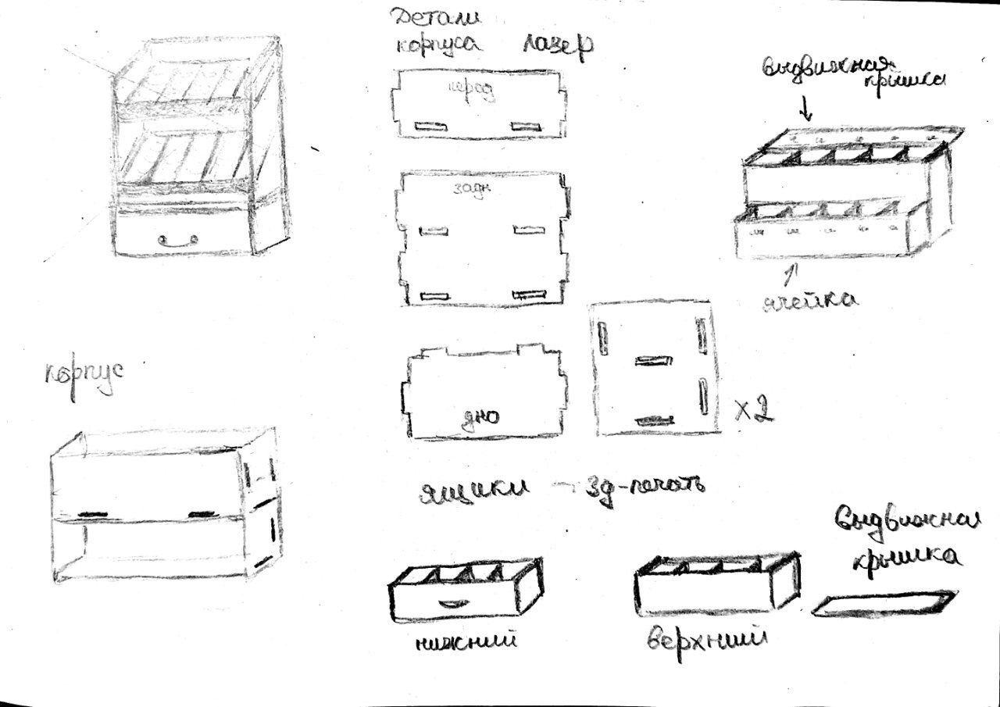
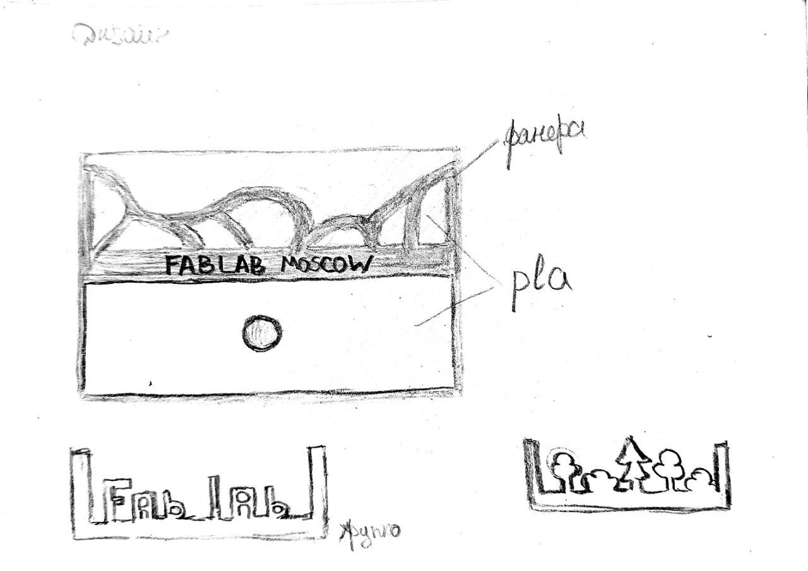
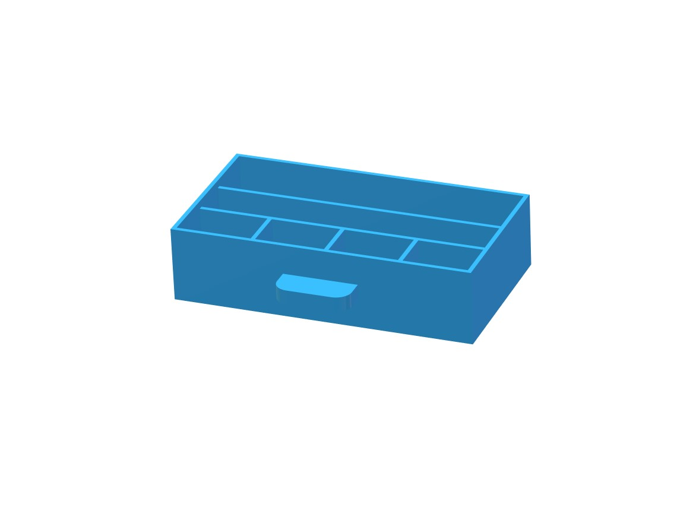
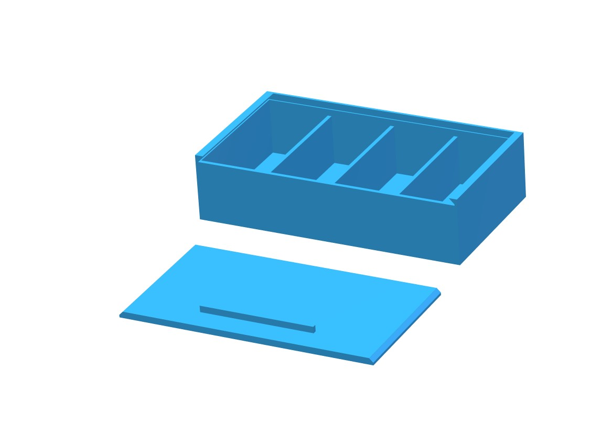
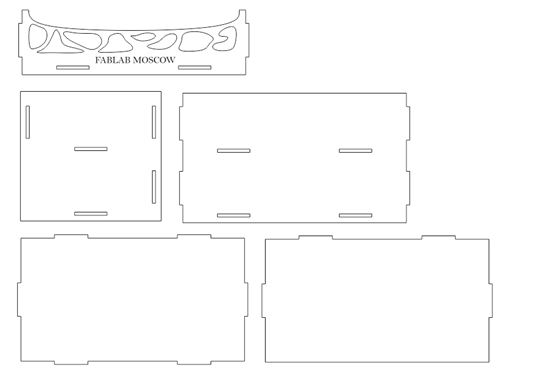
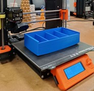
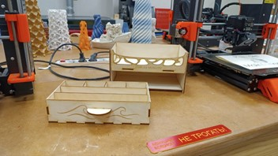
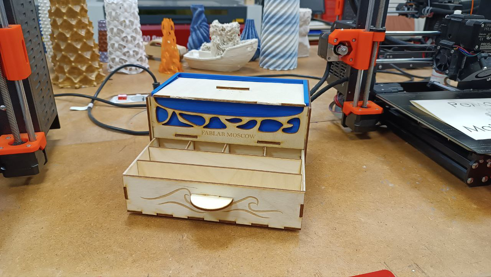
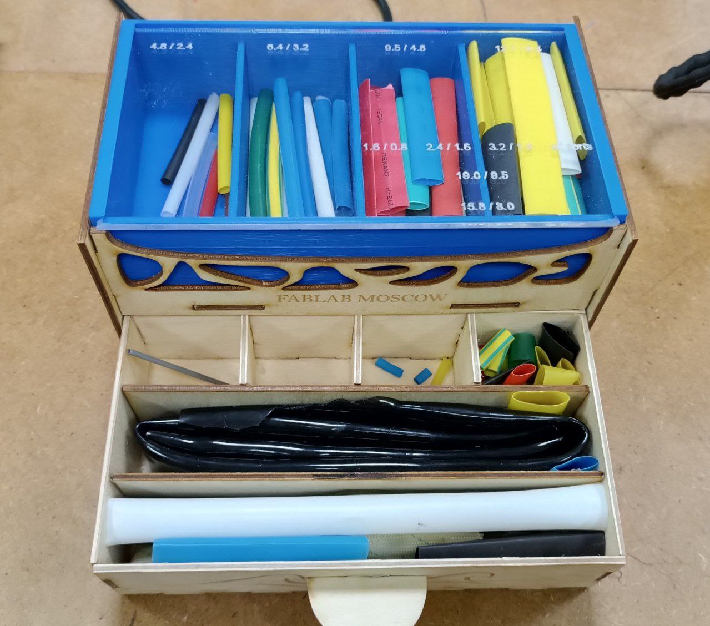
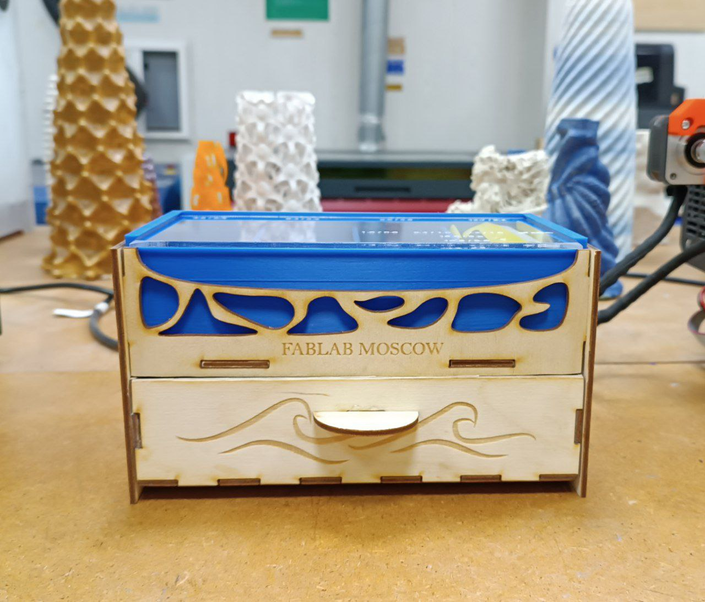

# Shrink-tubes-organizer

### Исследование

Дано: термоусадочные трубки девяти разных диаметров. Длинна большинства трубок 60-110 мм. Самые длинные 200 мм. Длина самых маленьких с меньшим диметром 10-20 мм.

Поиск в интернете проводился по запросу "органайзер (контейнер) для термоусадочных трубок" на русском и английском языках. Результаты идентичны и все сводятся к привычным контейнерам с несколькими отсеками для трубок разной длины. Всего было найдено три вида разных контейнеров, отличающихся, разве что, размером и механизмом открытия и закрытия крышки. В целом, для решения задачи комплектации трубок подойдет любой удобный контенер с отсеками. 

| Существующие решения      | Достоинства          | Недостатки |
|---------------------------|----------------------|------------|
|[Бокс переносной с ручкой](https://www.tinytronics.nl/shop/en/tools-and-mounting/installation-and-mounting-material/heat-shrink-tubing/heat-shrink-tubing-kit-in-box-coloured-505-pieces)| Все нужные параметры под размеры имеющихся термоусадок | Ненужная ручка, неэстетичный вид |
|[Контейнер с крышкой](https://sl.aliexpress.ru/p?key=YzjJUIn) | Простота, есть резьба для регулирования размеров перегородок отсеков | Неэстетичный вид, не хватает отсеков |
|[Органайзер с выдвижной крышкой для трубок длинной 40 мм (модель для 3D-печати)](https://www.thingiverse.com/thing:4410437) | Минимализм | Очень маленькая |

Вывод: любую существующую модель можно переделать под нужный размер и доработать дизайн

### Доска вдохновения

[Miro. Shrink-tubes-organizer](https://miro.com/welcomeonboard/V0tsdHA0bVhsWVZuT2hpaVNEZVlDTWJCRUJZbVh0aGRsM0RycVFKY2ZiNDJUR2g2aEFEN1g2MGpqeU9pekZhT3wzMDc0NDU3MzUxOTc5OTc5NTY3fDI=?share_link_id=810120161103)

### Скетчинг

Рис. 1 - Наброски вида органайзера и его сборочных деталей

Рис.2 - Наброски дизайна органайзера

Решение задачи: Каркас из фанеры, с фигурной резной передней частью. В каркас будет вставляться напечатанный полимером ящик с отсеками. Таким образом, будет создан фон для передней композиции из фанеры.

### Моделирование и подготовка к печати

Программное обеспечение: SolidWorks, CorelDraw, Prusia Slicer

Рис.3 - Трехмерная модель нижнего ящика

Рис.4 - Трехмерная модель верхнего ящика с крышкой

Рис.5 - Чертеж каркаса

### Изготовление и сборка

| Материалы        | Применение         | Стоимость*        | Оборудование       |
|------------------|--------------------|-------------------|--------------------|
|Лист фанеры 3 мм  | Каркас и нижний ящик | 330 руб | Лазерный станок GCC Spirit GLS100 |
|Filament PLA  | Верхний ящик| 450 руб | 3D-принтер Prusa i3 MK3 |

*рассчитано, исходя из указанной в интернете стоимости материала

Рис.6 - Полученный элемент органайзера с помощью 3D-принтера

Рис.7 - Полученные элементы органайзера с помощью лазерного станка

### Предварительный результат

Рис.8 - Прототип будущего органайзера

**Тестирование:**

https://github.com/Darya-Akhiyarova/Shrink-tubes-organizer/assets/144244924/3e7f9fd6-e203-488f-a2aa-67e88f5a0176

Что нужно доработать:
1. Прозрачная крышка с гравировкой диаметров термоусадок
2. Обработать нижний ящик шлифовально машиной, чтобы он мог свободно перемещаться

## Результат

Материалом для прозрачной крышки послужил акрил. Крышка с гравировкой изготовлена на лазерном станке. Форма краям придавалась надфилем. 
Ящик из фанеры был обработан шлифовальной машинкой со всех сторон. 

Рис. 9 - Органайзер (вид сверху)

Рис. 10 - Органайзер (вид спереди)

**Тестирование:**

https://github.com/Darya-Akhiyarova/Shrink-tubes-organizer/assets/144244924/4c07b305-75bd-44a6-8f24-826560503578

